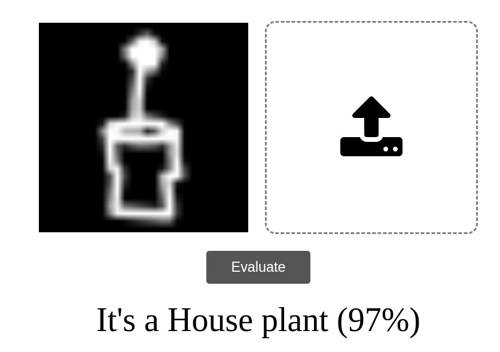

# NeuraRust

This project is to help me improve my mathematics knowledge about Neural Networks. 

## Functionalities
Functionalities already implemented or that I want to implement soon.

- [x] Able to create Networks of n hidden layers;
- [x] Able to use RMSProp as the Optimizer;
- [ ] Able to use Adam as the Optimizer;
- [ ] Able to use Adagrad as the Optimizer;
- [ ] Able to use Adamax as the Optimizer;
- [ ] Able to use Adadelta as the Optimizer;
- [x] Batch training;
- [ ] Parallel training;
- [ ] Export model;
- [ ] Import model;
- [ ] Turn into a Rust Library (Crate).

## Some images
The below prediction are for the [quickdraw dataset](https://github.com/googlecreativelab/quickdraw-dataset) provided by Google

